# Excel Data Analysis & Visualisation Labs

This project showcases two hands-on labs that I completed to analyse and visualise data using **Microsoft Excel**. Users will learn how to create pivot tables, generate charts, and format visualisations for clear data interpretation.

---

## Lab 1: Pivot Tables & Data Visualisation

In this lab, I:

* Create a Pivot Table to explore bicycle sales data.
* Analyse demographic purchasing patterns.
* Rearrange, group, and refine pivot table layouts.
* Add gender and age segmentation for deeper insights.
* Generate a stacked column chart based on pivot table results.
* Use the visualisation to identify sales trends and marketing opportunities.

### **What This Shows**

* Pivot tables showing age groups, countries, and order quantities.
* Collapsible groupings for easier data exploration.
* Cleaned and formatted tables with zero-filled empty cells.
* A stacked column chart titled **"Sales Summary"**, visually comparing demographics.

---

## Lab 1 – Pivot Tables & Visualisation

### Screenshots:

**P1 – Creating an Excel Pivot Table**

Screenshot showing the first pivot table created.

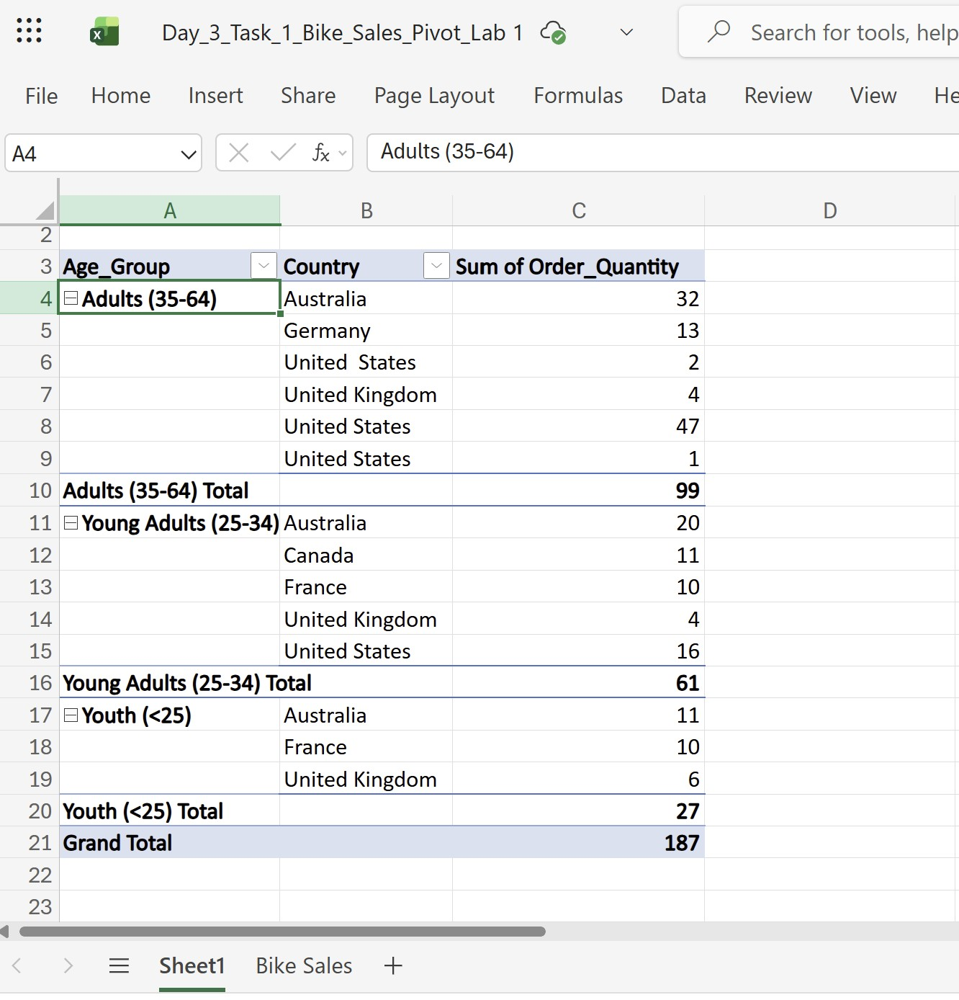

**P2 – Rearrange the Pivot Table**

Screenshot showing countries displayed as rows after rearranging fields.

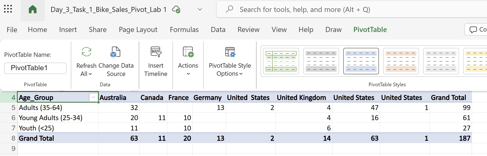

**P3 – Refine and revise the Pivot Table**

Screenshot showing the pivot table with blank cells replaced by zeros and enhanced by adding the Customer Gender field as a new column in the pivot table.

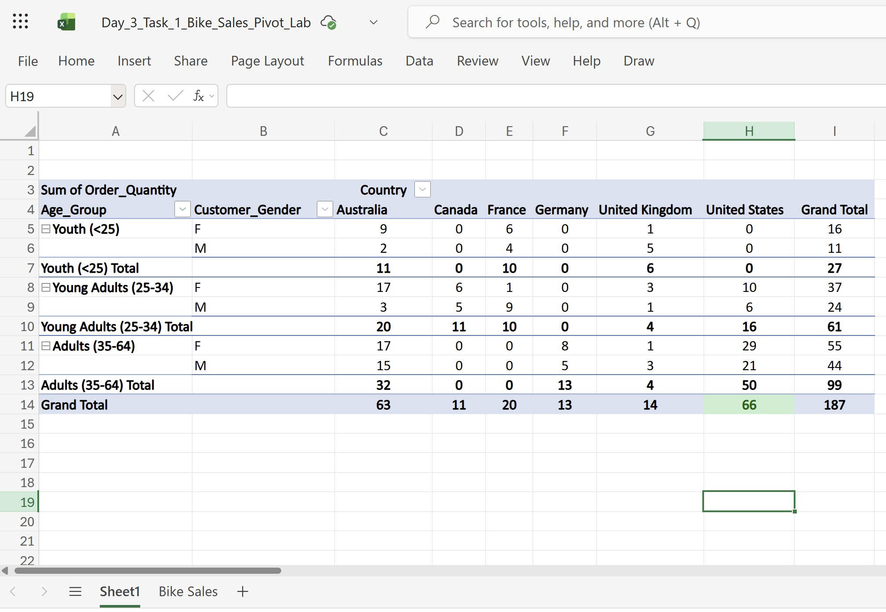

**P4 – Create a Pivot Table chart**

Screenshot of the stacked column chart titled “Sales Summary.”

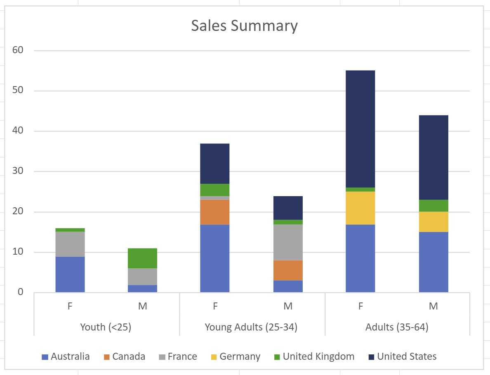

**P5 – Chart with Gender Hidden**

Screenshot of the same chart after collapsing gender categories.

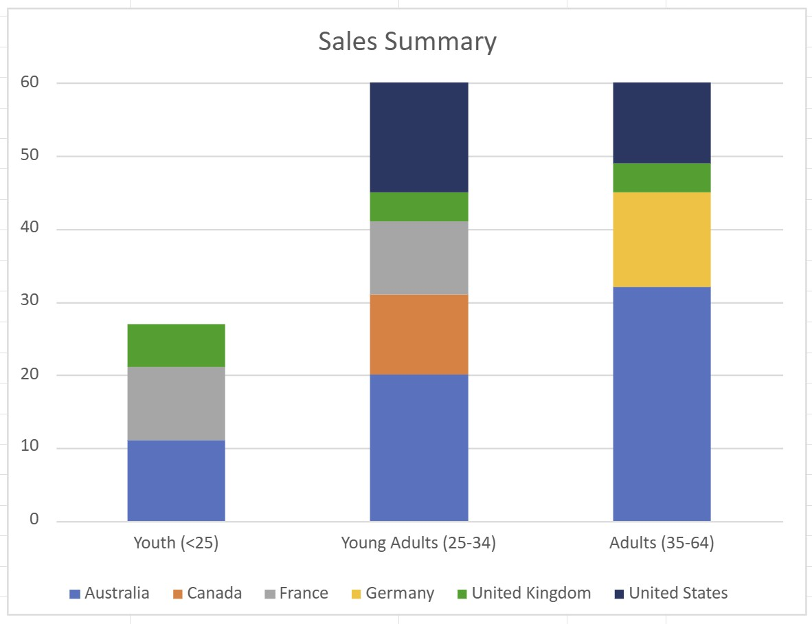

**P6 – Conditional Formatting (Highest & Lowest Values)**

Screenshot showing conditional formatting applied: pink for the lowest, green/yellow for the highest values.

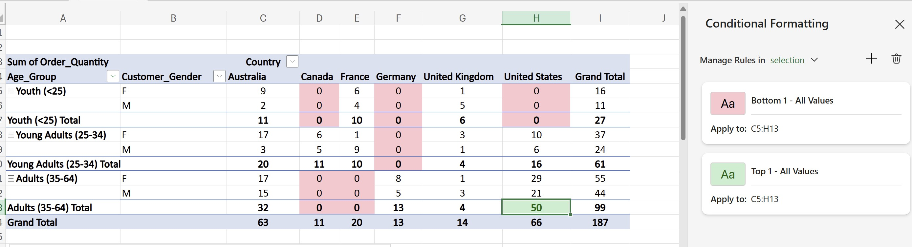

**P7 – Conditional Formatting (Age Groups Only)**

Screenshot showing conditional formatting applied only to age groups, ignoring gender values.

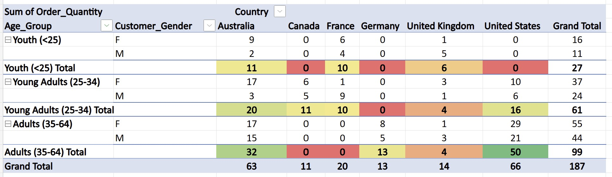

**P8 – Full Conditional Formatting (All Data, Including Gender)**

Screenshot showing conditional formatting applied across all data, including gender categories.

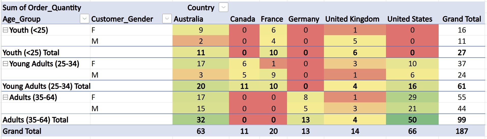

---

## Lab 2: Data Visualisation (Line, Column, Pie Charts)

This lab focuses entirely on chart creation and formatting. I:

* Build a **Line Chart** comparing Revenue and Profit from 2017–2021.
* Create a **Stacked Column Chart** showing product revenue by country.
* Generate a **Pie Chart** illustrating revenue distribution across age groups.
* Add titles, format legends, adjust axis labels, and add data labels.

### **What This Shows**

* A line chart titled **"Revenue vs. Profits"** with currency formatting and axis titles.
* A stacked column chart titled **"Product Revenue by Country"**.
* A pie chart titled **"Revenue Comparison by Age Group"** with category and percentage labels.

---

## Lab 2 – Visualisation Charts

### Screenshots:

**V1 – Creating a Line Chart: (Table + Line Chart)**

Screenshot showing the Revenue & Profit table with the generated line chart.

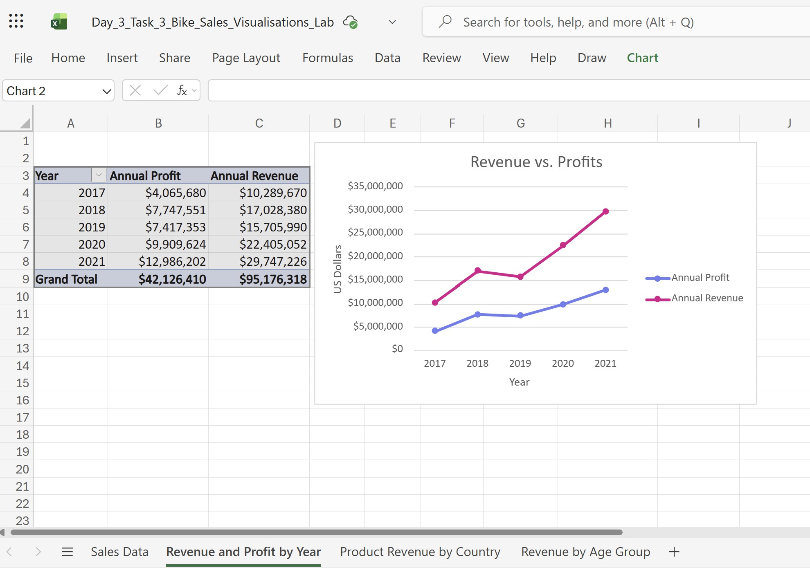

**V1.1 – Revenue vs. Profits (Formatted Line Chart)**

Screenshot of the fully formatted “Revenue vs. Profits” line chart.

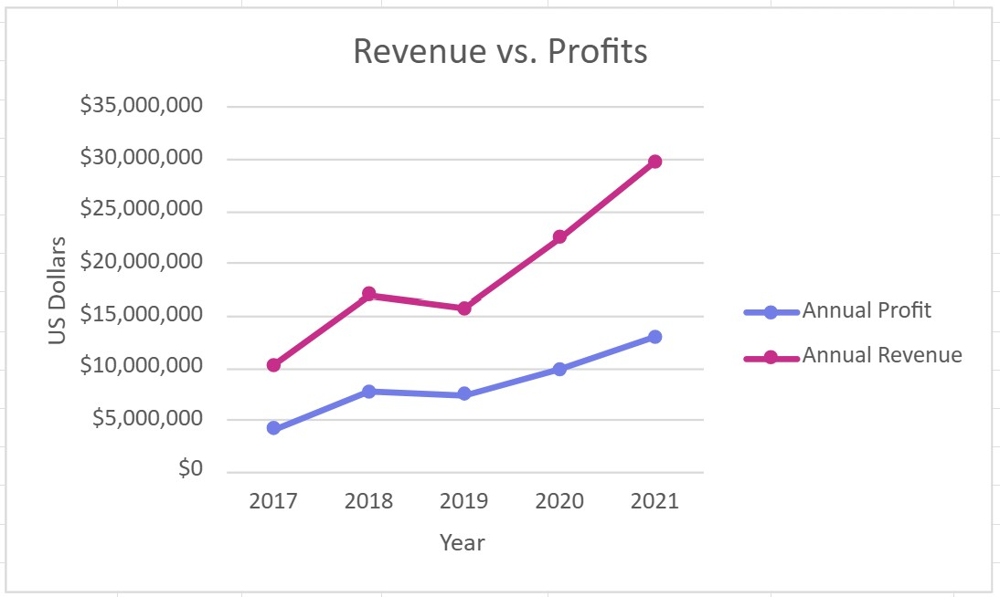

**V2 – Creating a Column Chart: (Table + Column Chart)**

Screenshot showing the Product Revenue by Country table and the stacked column chart.

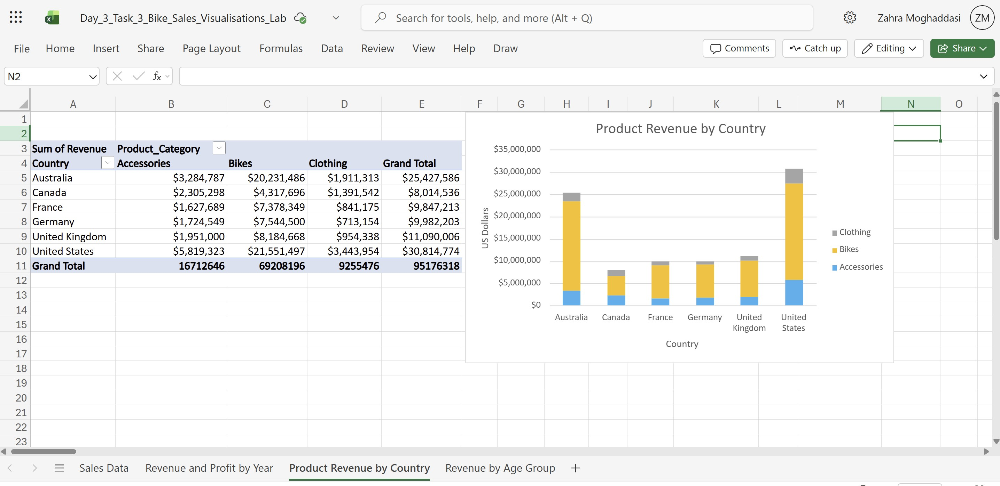

**V2.1 – Product Revenue by Country (Formatted Chart)**

Screenshot of the finished column chart with titles, axis labels, and legend on the right.

**V3 – Creating a Pie Chart: (Table + Pie Chart)**

Screenshot showing the table used to build the pie chart.

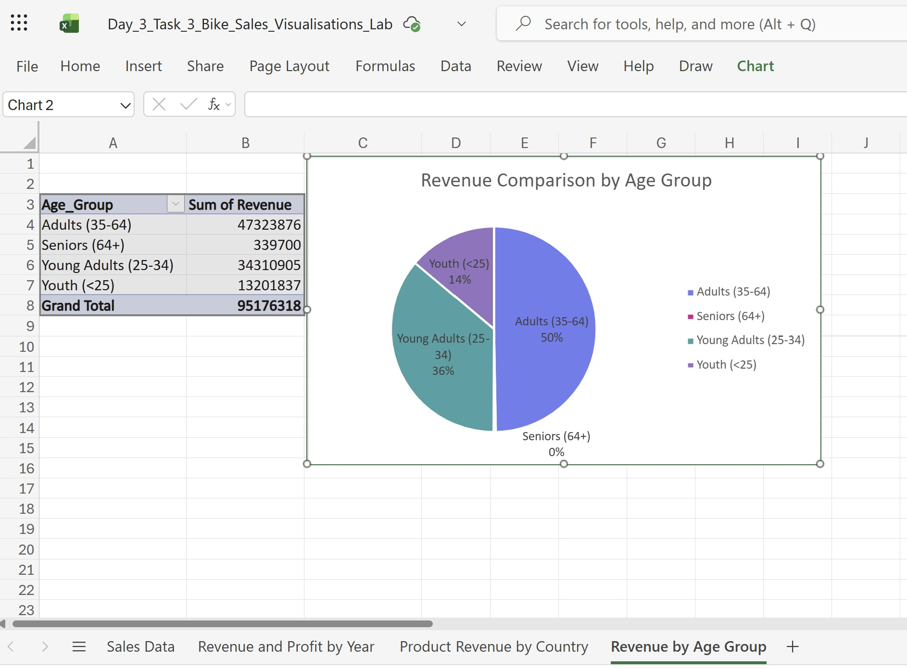

**V3.1 – Revenue Comparison by Age Group (Formatted Pie Chart)**

Screenshot of the completed pie chart with category labels and percentages.

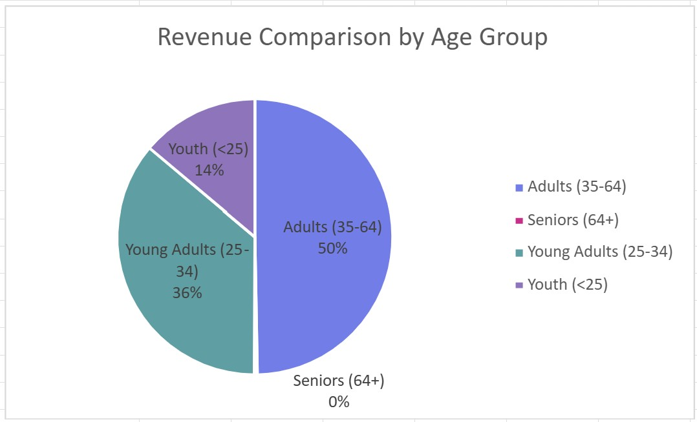
