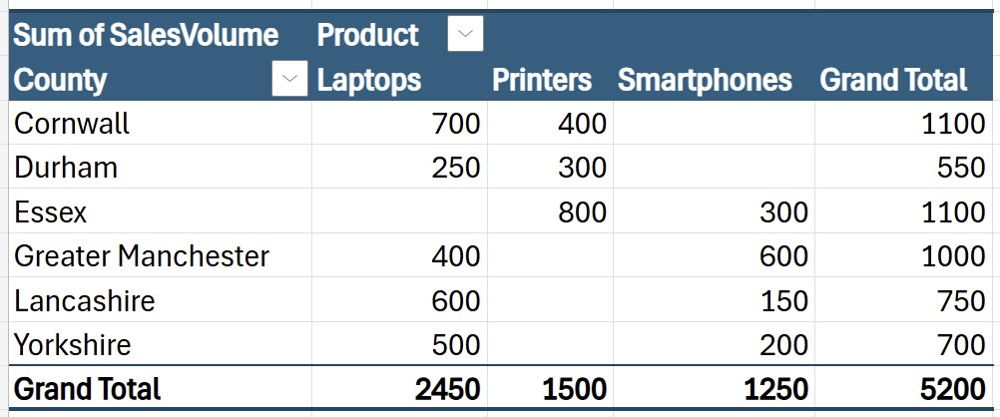
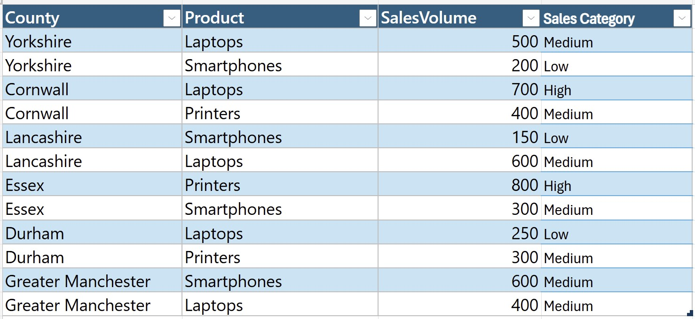

# Sales Performance Analysis

A small Excel project focused on understanding data cleaning, Pivot Tables, and the **SWITCH() function** for categorising sales data.

---

## Project Overview

This project uses an Excel dataset containing sales volumes for different products across several counties in England.

The goal is to:

- Clean and prepare the dataset
- Create a Pivot Table summarising product sales by county
- Use the SWITCH() function to categorise sales volumes into High, Medium, and Low
- Provide visual evidence through screenshots

This exercise is designed to build confidence in data cleaning and formula-based categorisation in Excel.

--- 

### Step 1 — Data Cleaning

Before analysis, the dataset was cleaned to ensure accuracy:

- Removed trailing spaces from the Sales Volume column
- Ensured all sales values were numeric
- Formatted the dataset as a proper Excel table for easier analysis

### Step 2 — Pivot Table

A Pivot Table was created to summarise total sales by:

- Rows: County
- Columns: Product
- Values: Sum of Sales Volume

*Pivot Table screenshot*



### Step 3 — Categorising Sales Using the SWITCH Function

To classify products by sales volume, a new column was added using the SWITCH() function.

Formula Used:
```excel
=SWITCH(TRUE, [@SalesVolume] > 600, "High", [@SalesVolume] >= 300, "Medium", "Low")
```
This formula was applied across all rows to categorise each product automatically.

*Sales Category Column screenshot*



## Files Included:

- Excel file containing:
-- Cleaned dataset
-- Pivot Table
-- SWITCH() categorisation column

- Screenshots:
-- Pivot Table
-- Sales category output

---

## Purpose of This Project

This is a small learning project to help understand:

- How to clean data in Excel
- How to create Pivot Tables
- How to use Excel’s SWITCH() function for conditional logic
